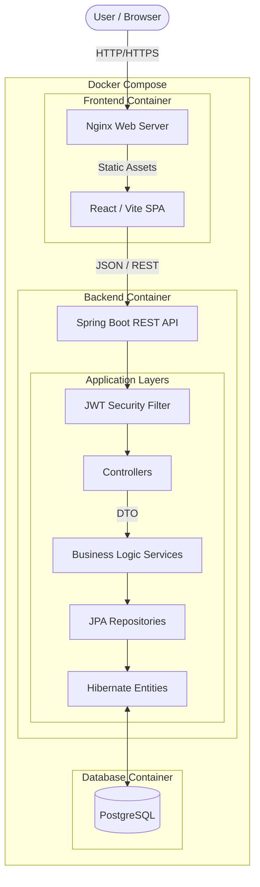
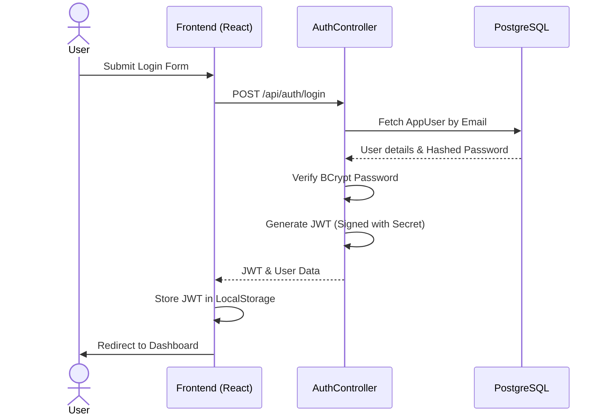
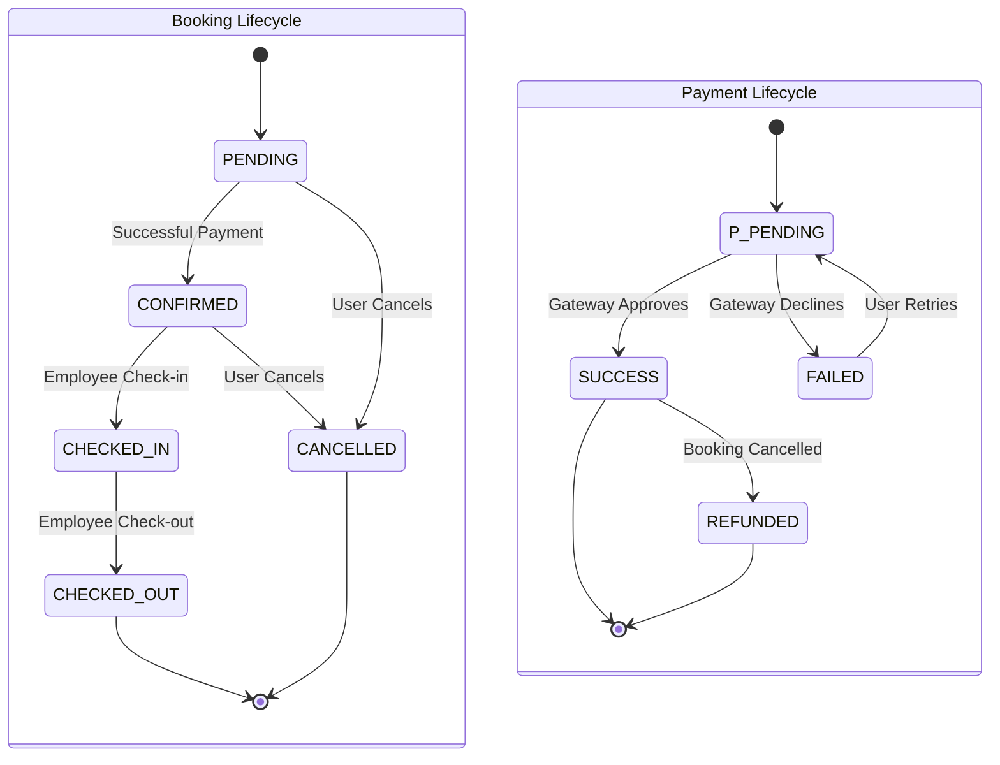
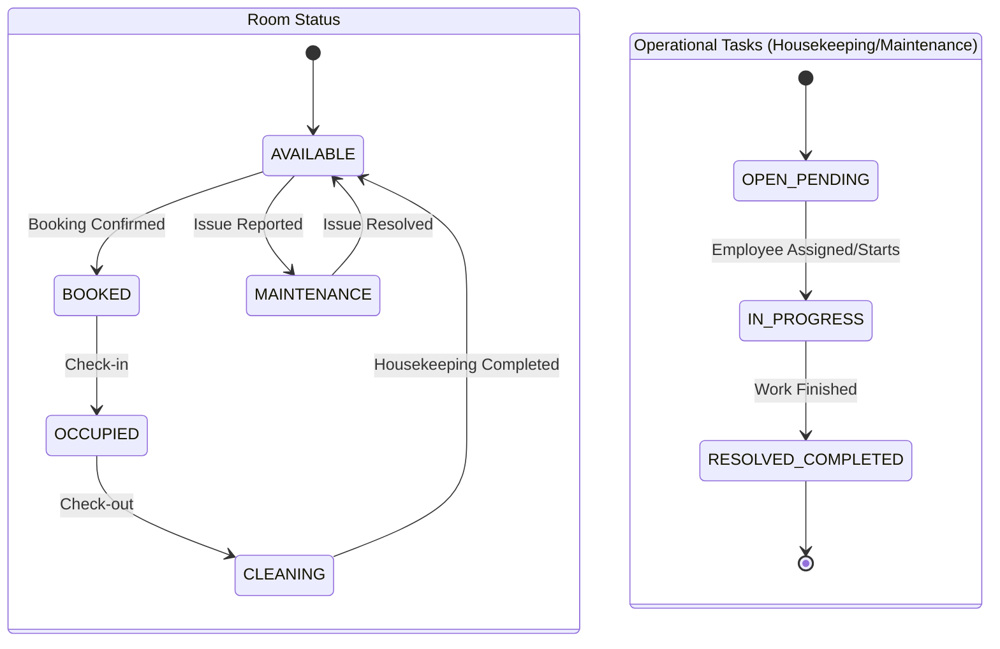
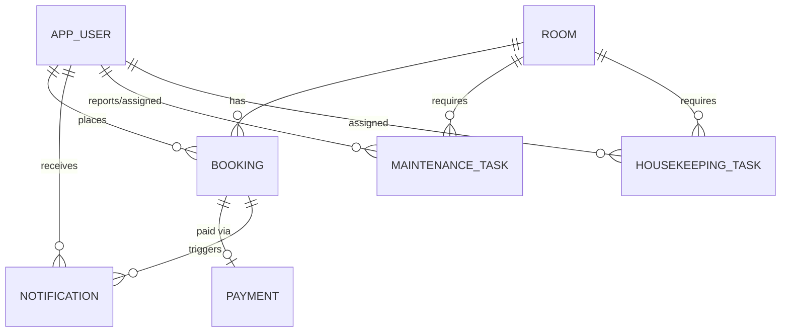

# Resort Management System

The Resort Management System is a comprehensive, full-stack application designed to streamline the operations of a luxury resort or hotel. It provides an intuitive interface for customers to browse and book rooms, while giving employees and administrators the tools they need to manage reservations, process simulated payments, handle check-ins and check-outs, and track operational tasks like housekeeping and maintenance.

## 🌐 Live Demo

👉 https://resort-management-system-nine.vercel.app

> Demo deployment using Vercel, Render, and Neon PostgreSQL.
> Payments are simulated for demonstration purposes.

## Documentation

For an in-depth understanding of the system, please refer to the detailed technical documentation:
- [Architecture](docs/architecture.md)
- [Complete Data Flow](docs/data-flow.md)
- [Database](docs/database.md)
- [API Reference](docs/api.md)
- [Deployment](docs/deployment.md)

## 1. Features

- **Authentication & Security:** JWT-based stateless authentication with strict Role-Based Access Control (RBAC).
- **Customer Portal:** Browse rooms, check availability, book stays, and view personal booking history and notifications.
- **Room Management:** Real-time availability tracking that prevents overbooking by validating against existing reservations.
- **Booking Lifecycle:** Full state-machine enforced booking progression (Pending → Confirmed → Checked In → Checked Out).
- **Payment Processing (Demo):** A simulated payment gateway to demonstrate the checkout flow without processing real financial transactions.
- **Operations Dashboard:** Centralized view of today's arrivals, departures, and active guests for employees and admins.
- **Check-in/Check-out Operations:** Dedicated workflows that automatically transition room states (e.g., Check-out triggers the Room to require `CLEANING` and creates a housekeeping task).
- **Housekeeping & Maintenance:** Task management system to track cleaning and repair progress, ensuring rooms are only made available once prepared.
- **Notifications:** In-app customer notifications for booking events and check-in reminders.
- **Analytics:** Administrative charts and metrics tracking revenue, occupancy rates, and room performance.
- **Containerization:** Fully Dockerized infrastructure with multi-stage builds and a PostgreSQL database setup.

## 2. Technology Stack

| Layer | Technologies Used |
|-------|-------------------|
| **Frontend** | React (19.2), Vite (8.2), Tailwind CSS (4.3), shadcn/ui, Nginx |
| **Backend** | Java (17), Spring Boot (4.1.1), Spring Security, JJWT (0.12) |
| **Database** | PostgreSQL (15-alpine), Spring Data JPA, Hibernate |
| **Infrastructure** | Docker, Docker Compose |
| **Testing** | JUnit, Spring Boot Test |

## 3. System Architecture



## 4. Complete Data Flow

1. **Client Interaction:** The user interacts with the React UI, which is served statically by Nginx.
2. **API Request:** The `apiClient.js` service constructs an HTTP request, automatically attaching the JWT Authorization header if present.
3. **Security Interception:** The Spring Boot `JwtAuthenticationFilter` validates the token and sets the security context.
4. **Controller Routing:** The appropriate Spring `@RestController` receives the request and validates the incoming Request DTO.
5. **Business Logic:** The Controller passes the validated DTO to a `@Service` class. The Service enforces business rules (e.g., checking if dates overlap, verifying customer ownership).
6. **Data Persistence:** The Service calls a Spring Data JPA Repository interface to query or mutate Entities.
7. **Database Transaction:** Hibernate translates the Entity operations into SQL against the PostgreSQL database.
8. **Response:** The Entity data is mapped back into a Response DTO by the Service, returned by the Controller as JSON, and finally rendered by the React components.

## 5. Authentication Flow



## 6. User Roles

| Role | Responsibilities |
|------|------------------|
| **CUSTOMER** | Browse rooms, create bookings, process payments, view own booking history, and receive notifications. Cannot access administrative or operational endpoints. |
| **EMPLOYEE** | View operational dashboards, process check-ins and check-outs, update housekeeping and maintenance task statuses. Cannot modify system configurations or view global revenue analytics. |
| **ADMIN** | Full system access. Can manage users (employees), view comprehensive financial and occupancy analytics, and perform any employee-level action. |

## 7. Core Business Workflows

### Room Availability
Availability is calculated dynamically using custom JPQL queries. A room is considered unavailable for a requested date range if it has any `PENDING` or `CONFIRMED` bookings where the check-in and check-out dates overlap with the requested dates.

### Booking & Payment (Demo)
A user selects dates and a room. The system validates availability and capacity, then creates a `PENDING` booking. The user is redirected to a simulated payment gateway. Upon successful simulated payment, the gateway triggers a state change, marking the payment as `SUCCESS` and the booking as `CONFIRMED`. *Note: The current payment system is for demonstration purposes only and does not process real money.*

### Check-in
An employee initiates check-in. The system verifies the booking is `CONFIRMED` and the arrival date matches. It then transitions the Booking to `CHECKED_IN` and the Room to `OCCUPIED`.

### Check-out
An employee initiates check-out. The system transitions the Booking to `CHECKED_OUT`. To enforce operational safety, it immediately transitions the Room to `CLEANING` and automatically generates a `PENDING` Housekeeping task.

### Housekeeping
Housekeeping tasks track room cleaning. When an employee marks a task as `COMPLETED`, the system automatically transitions the corresponding Room state back to `AVAILABLE` (if no maintenance is required).

### Maintenance
Maintenance workflows represent physical room issues. When a maintenance task is created, the Room is marked as `MAINTENANCE` (blocking future bookings until resolved). Once the task is `RESOLVED`, the system determines if follow-up cleaning is required before returning the room to `AVAILABLE`.

### Notifications & Analytics
The system generates in-app notifications for lifecycle events (Booking Created, Confirmed, Cancelled). Analytics services aggregate daily/monthly revenue and occupancy metrics for administrative dashboards.

## 8. State Machines

### Booking & Payment States


### Room & Task States


## 9. Database / ER Diagram


* **AppUser** stores all user accounts (Customers, Employees, Admins).
* **Room** holds physical room details and current state.
* **Booking** links a Customer to a Room for a specific date range.
* Operational entities (**Payment**, **Tasks**, **Notifications**) track the lifecycle and operational requirements of Bookings and Rooms.

## 10. Project Structure

```text
resort-management-system/
├── backend/
│   ├── src/main/java/com/paradiseresort/backend/
│   │   ├── config/       # Spring configurations and initializers
│   │   ├── controller/   # REST API endpoints
│   │   ├── dto/          # Data Transfer Objects
│   │   ├── entity/       # Hibernate JPA Entities
│   │   ├── exception/    # Global error handling
│   │   ├── repository/   # Database access interfaces
│   │   ├── security/     # JWT filters and auth logic
│   │   └── service/      # Core business logic
│   ├── pom.xml
│   └── Dockerfile
├── frontend/
│   ├── src/
│   │   ├── components/   # Reusable React UI components
│   │   ├── pages/        # Route-level view components
│   │   ├── services/     # API integration layer
│   │   └── utils/        # Helper functions (currency, dates)
│   ├── package.json
│   ├── vite.config.js
│   ├── nginx.conf
│   └── Dockerfile
├── docker-compose.yml
├── .env.example
└── README.md
```

## 11. Backend Architecture
The Spring Boot backend uses a strict layered architecture:
- **Controllers** are kept thin, responsible only for HTTP routing, method-level authorization (`@PreAuthorize`), and delegating DTOs to Services.
- **Services** contain the core business rules. They ensure that database operations are wrapped in transactions and that complex rules (like date overlaps) are enforced safely.
- **Repositories** handle all direct database interactions using Spring Data JPA.
- **Exception Handling** is centralized. Services throw standard exceptions (e.g., `IllegalStateException`), which are caught globally and translated into clean, standardized JSON error responses.

## 12. Frontend Architecture
The Vite/React frontend is built for performance and modularity:
- **Pages & Components:** View logic is split between broad page layouts and highly reusable atomic components (like `StatusBadge`).
- **Services:** All `fetch` calls are centralized in service files (e.g., `bookingService.js`), utilizing a core `apiClient.js` that automatically attaches the JWT token and handles 401 Unauthorized redirects.
- **Routing:** React Router DOM manages client-side navigation. A `ProtectedRoute` component wraps administrative and customer-only routes, preventing unauthorized access at the client level.
- **Design System:** Tailwind CSS and shadcn/ui provide a consistent, responsive, and accessible user interface.

## 13. Security
- **Stateless Sessions:** JWTs ensure the backend does not need to store session state.
- **Password Hashing:** BCrypt prevents plaintext password storage.
- **Strict Authorization:** Endpoints verify that the authenticated user possesses the correct `Role`.
- **Ownership Validation:** Customer-facing endpoints explicitly check that the resource being accessed (like a Booking or Payment) actually belongs to the authenticated user ID extracted from the JWT.
- **CORS:** Cross-Origin Resource Sharing is strictly configured to only accept requests from the designated frontend URL.
- **Secret Management:** Secrets are never hardcoded. They are injected at runtime via environment variables.

## 14. Configuration

The system requires environment variables to function correctly. A template is provided in `.env.example`.

| Variable | Purpose | Required |
|----------|---------|----------|
| `POSTGRES_DB` | Name of the PostgreSQL database | Yes |
| `POSTGRES_USER` | PostgreSQL user | Yes |
| `POSTGRES_PASSWORD` | PostgreSQL password | Yes |
| `JWT_SECRET` | Secret key used to sign JWTs (min 256 bits) | Yes |
| `ADMIN_EMAIL` | Email for the default admin account | Yes |
| `ADMIN_PASSWORD` | Password for the default admin account | Yes |
| `VITE_API_URL` | Frontend build arg: The absolute URL to the backend API | Yes (for Production) |
| `FRONTEND_URL` | Backend env var: The allowed CORS origin | Yes (for Production) |

*Note: For local development, Docker Compose defaults `VITE_API_URL` to `http://localhost:8080` and `FRONTEND_URL` to `http://localhost:5173`. These must be overridden in a production environment.*

## 15. Local Development

### Running with Docker Compose (Recommended)
This command builds and starts the entire system (Database, Backend, Frontend).
```bash
# 1. Copy the environment template
cp .env.example .env

# 2. Start the system
docker compose up --build
```
- Frontend: `http://localhost:5173`
- Backend API: `http://localhost:8080`

### Running Backend Manually
```bash
cd backend
./mvnw clean spring-boot:run
```

### Running Frontend Manually
```bash
cd frontend
npm install
npm run dev
```

## 16. Docker Architecture
The `docker-compose.yml` orchestrates three primary services:
1. **db (PostgreSQL):** Uses the official Alpine image. Persists data to a named volume (`postgres_data`) to survive restarts.
2. **backend:** Built using a multi-stage Dockerfile to keep the final image lightweight (JRE only). It depends on the `db` service healthcheck.
3. **frontend:** Built using Node and served via a lightweight Nginx Alpine container. It is configured to route all traffic to `index.html` to support the React SPA router.

## 17. Testing
The repository includes a comprehensive integration test suite for the backend, verifying end-to-end flows against a live persistence context.

**Current Test Status:**
- Backend Tests: `49 tests run, 49 passed, 0 failures`
- Frontend Build: `2892 modules transformed, build successful`

To run backend tests locally:
```bash
cd backend
./mvnw test
```

## 18. Demo Payment
This project currently integrates a **simulated demo payment gateway** to demonstrate the checkout flow for educational and presentation purposes. It **does not process real financial transactions**. A real-world production deployment would replace `TestPaymentGateway` with a concrete implementation for a provider like Stripe or Razorpay.

## 19. Deployment Architecture

**Local Development:**
- Fully containerized (`docker compose up --build`).
- Nginx automatically reverse-proxies `/api/*` traffic to the backend (`backend:8080`).

**GHCR Images Prepared:**
- **Backend image:** `ghcr.io/abhinay-codes/resort-management-system-backend`
- **Frontend image:** `ghcr.io/abhinay-codes/resort-management-system-frontend`

**Planned Cloud Architecture:**
- **Code Hosting:** GitHub
- **CI/CD:** GitHub Actions publishes backend/frontend images to GHCR.
- **Backend Hosting:** Render or AWS pulling the GHCR backend image.
- **Frontend Hosting:** Vercel. A `vercel.json` file is prepared to natively proxy `/api/*` requests to the Render backend, perfectly mimicking the local Nginx architecture. Before deployment, update the placeholder `<YOUR_RENDER_BACKEND_URL>` inside `frontend/vercel.json`.

## 20. Current Project Status
- ✅ Core features implemented
- ✅ Integration tests passing
- ✅ Production frontend build passing
- ✅ Docker configuration validated
- ✅ GitHub repository published
- ✅ GHCR GitHub Actions workflow prepared
- ⚠️ Demo payment only (Simulated)
- ✅ Cloud deployment configured

## 21. Future Improvements
- Integration with a real payment gateway (Stripe/Razorpay).
- Implementation of Flyway or Liquibase for robust database schema migrations.
- Email and SMS notifications for booking confirmations and reminders.
- Cloud Object Storage (e.g., AWS S3) for room imagery.
 

