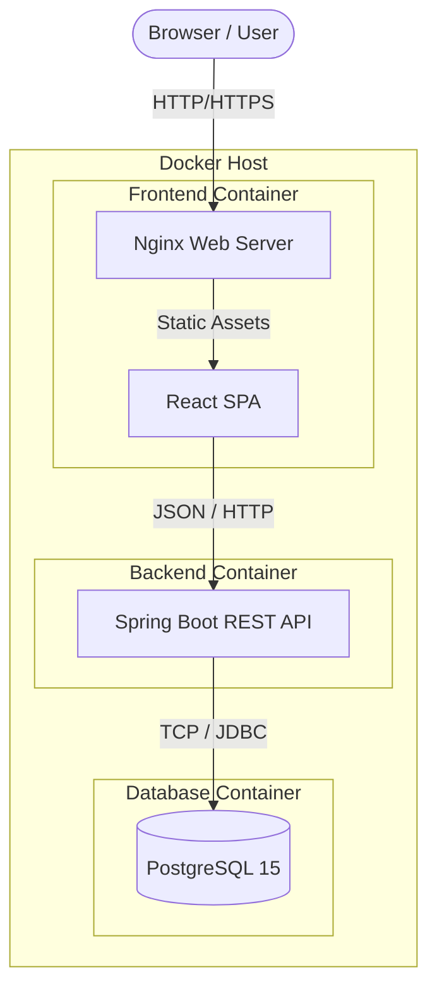
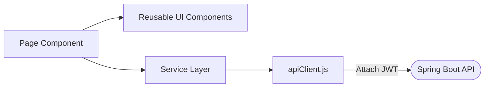
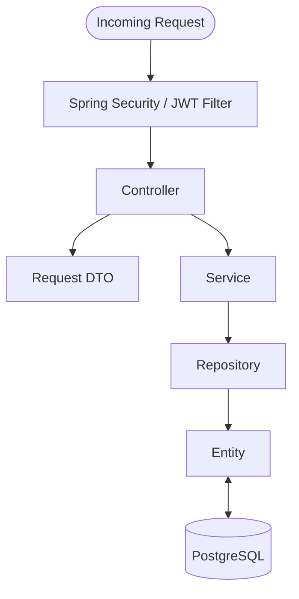
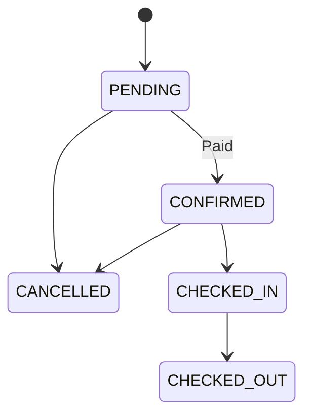
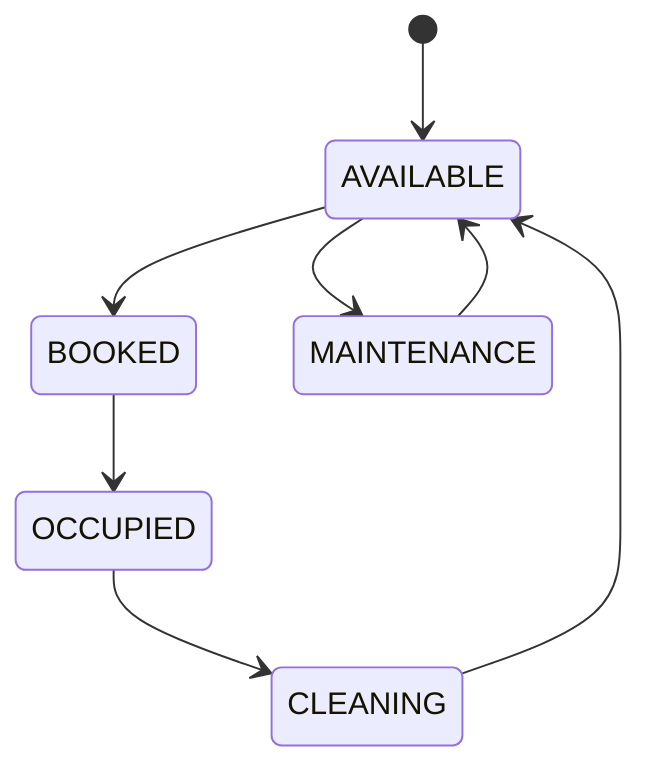
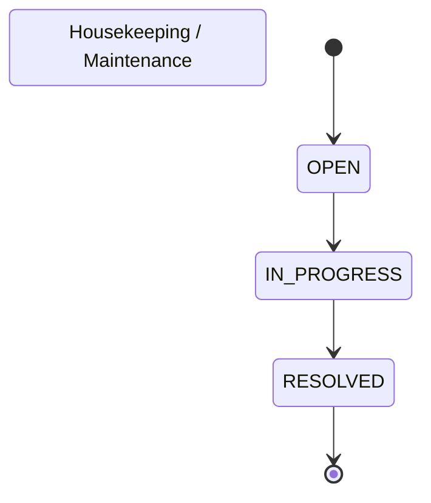

# System Architecture

This document details the architecture of the Resort Management System, covering the high-level infrastructure, backend, frontend, security, business domain, state management, error handling, and Docker configuration.

## 1. High-Level Architecture

The system operates as a modernized monolith utilizing a decoupled frontend and backend, orchestrated by Docker.



## 2. Frontend Architecture

The frontend is a Single Page Application (SPA) built for performance and maintainability.

- **Framework:** React (19.2) with Vite (8.2) for fast bundling and HMR.
- **Routing:** React Router DOM manages client-side navigation.
- **Architecture:** 
  - **Pages:** Feature-specific view components (`CustomerDashboard`, `EmployeeHome`, `Rooms`).
  - **Components:** Reusable UI components (`RoomCard`, `StatusBadge`, `StatCard`).
  - **Services (API Layer):** Domain-specific HTTP wrappers (`bookingService.js`) using a centralized `apiClient.js` to handle token injection and 401 intercepts.
- **Authentication Handling:** Tokens are stored in `localStorage`. The `ProtectedRoute` component restricts routing based on the user's role.
- **Styling:** Tailwind CSS for utility-first styling, paired with shadcn/ui for accessible, pre-built components.



## 3. Backend Architecture

The backend is built on Spring Boot (Java 17) and strictly follows a layered architectural pattern.

- **Controller:** Defines HTTP endpoints (`@RestController`), handles parameter binding, and enforces method-level security (`@PreAuthorize`).
- **DTO:** Data Transfer Objects strictly enforce the contract between the API and internal logic, ensuring entities are not exposed.
- **Service:** Contains the core business logic (`@Service`), transaction boundaries (`@Transactional`), and ownership validation.
- **Repository:** Spring Data JPA interfaces for database access.
- **Entity:** Hibernate/JPA models representing database tables.



## 4. Backend Package Structure

```text
com.paradiseresort.backend
├── config       # Spring beans, CORS, initializers, scheduling
├── controller   # REST endpoints grouped by domain and role
├── dto          # Request and Response record/classes
├── entity       # JPA Entities and Enums (Statuses)
├── exception    # GlobalExceptionHandler and custom exceptions
├── logging      # AOP-based or custom loggers
├── payment      # Payment gateway abstractions
├── repository   # Spring Data JPA interfaces
├── security     # JWT filters, custom UserDetailsService, SecurityConfig
└── service      # Core business logic implementations
```

## 5. Security Architecture

The system uses stateless JWT authentication.

1. **Authentication:** A user submits credentials to `AuthController`. The `CustomUserDetailsService` verifies the BCrypt hash. If valid, a JWT signed with the `JWT_SECRET` is returned.
2. **Request Interception:** The `JwtAuthenticationFilter` intercepts incoming requests, validates the signature and expiration, and populates the `SecurityContext`.
3. **Role Authorization:** Controllers use `@PreAuthorize("hasRole('ADMIN')")` or similar to enforce endpoint access.
4. **Ownership Validation:** Inside the Service layer, operations involving specific data (like viewing a booking) explicitly verify that the ID of the authenticated user matches the owner of the resource.

## 6. Business Domain Architecture

- **AppUser:** Core identity entity.
- **Room:** Represents physical rooms. Tracks static details (capacity, name) and dynamic status.
- **Booking:** The core transactional record linking a Customer (AppUser) to a Room for a date range.
- **Payment:** Represents a financial transaction (simulated) tied to a Booking.
- **Operational Tasks:** `HousekeepingTask` and `MaintenanceTask` are linked to Rooms (and optionally assigned to Employees) to track cleaning and repairs.
- **Notification:** Linked to an AppUser and optionally a Booking, to deliver alerts.

## 7. State Management

The application heavily relies on strict state machines to ensure data integrity.

### Booking State


### Room State


### Operational States

*(Note: Housekeeping uses PENDING/COMPLETED terminology matching this flow).*

## 8. Error Handling Architecture

The system uses a centralized error-handling mechanism to ensure consistent API responses.

- **Controllers & Services** throw standard exceptions (`IllegalArgumentException`, `IllegalStateException`, `EntityNotFoundException`, or Spring Security exceptions).
- **GlobalExceptionHandler** (`@RestControllerAdvice`) intercepts these.
- **ApiError DTO:** The exception is mapped into a standardized `ApiError` format (containing `status`, `message`, `timestamp`).
- **HTTP Response:** An appropriate HTTP status code (400, 401, 403, 404, 409, 500) is returned.

## 9. Docker Architecture

- **Frontend Container:** Multi-stage build. Node installs dependencies and builds Vite. The output is copied to a lightweight Nginx Alpine container for static hosting on port 80 (mapped to 5173).
- **Backend Container:** Multi-stage build. Maven compiles the Spring Boot jar. The jar is copied to an Eclipse Temurin JRE container. Runs on port 8080.
- **Database Container:** `postgres:15-alpine`. Uses a named volume (`postgres_data`) for data persistence. It includes a `healthcheck` ensuring the database is ready before the backend starts.
- **Networking:** All containers run on an internal Docker bridge network (`resort-management-system_default`). They communicate using service names (`db`, `backend`).

