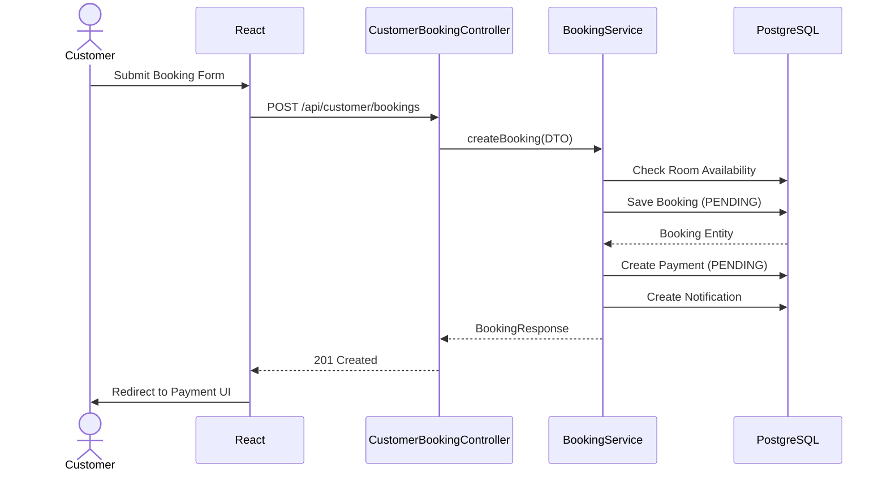

# Complete System Data Flow

This document outlines how information moves through the Resort Management System during critical business operations.

## A. Registration

1. **Actor:** Guest / User.
2. **Frontend Action:** User fills out the registration form and submits.
3. **API Request:** `POST /api/auth/register` with email, password, and name.
4. **Controller:** `AuthController.registerCustomer()`.
5. **Validation:** Checks if the email already exists in the system.
6. **Service:** `UserService.registerCustomer()`.
7. **Password Hashing:** The service uses `BCryptPasswordEncoder` to hash the plaintext password.
8. **Repository:** `AppUserRepository.save()`.
9. **Database:** Inserts a new row in the `users` table with `role = CUSTOMER`.
10. **Response:** Success message.
11. **Frontend Update:** Redirects user to the Login page.

## B. Login

1. **Frontend Action:** User enters email and password in the Login UI.
2. **API Request:** `POST /api/auth/login`.
3. **Authentication:** `AuthController.authenticate()` calls Spring's `AuthenticationManager`.
4. **BCrypt Verification:** Compares the provided password hash against the stored database hash.
5. **JWT Creation:** `JwtService.generateToken()` creates a token signed with `JWT_SECRET`.
6. **Response:** Returns the JWT and basic user metadata (role, name).
7. **Frontend Update:** `authService.js` stores the token in `localStorage`. React state updates to grant access.

**Subsequent Authenticated Requests:**
- React's `apiClient.js` attaches the JWT in the `Authorization: Bearer <token>` header.
- `JwtAuthenticationFilter` intercepts the request, validates the signature, and sets the `SecurityContext`.
- Spring Security checks `@PreAuthorize` annotations on the target controller.

## C. Room Availability

1. **Frontend Action:** Customer selects Check-in and Check-out dates.
2. **API Request:** `GET /api/rooms/available?checkIn=...&checkOut=...`
3. **Controller:** `RoomController.getAvailableRooms()`.
4. **Service:** `RoomService.findAvailableRooms()`.
5. **Database Query:** The service executes a JPQL query in `BookingRepository` to find rooms that **do not** have overlapping bookings.
   - *Overlap Rule:* A room is unavailable if a booking exists with `status` IN (`PENDING`, `CONFIRMED`, `CHECKED_IN`) where the existing check-in is before the requested check-out AND the existing check-out is after the requested check-in.
6. **Response:** List of available `RoomResponse` DTOs.
7. **Frontend Update:** Renders available rooms in the UI.

## D. Customer Booking

## E. Payment

*Note: The current implementation uses a simulated demo gateway (`TestPaymentGateway`) and does not process real money.*

1. **Frontend Action:** Customer clicks "Pay Now" for a `PENDING` payment.
2. **API Request:** `POST /api/payments/{paymentId}/test` targeting `TestPaymentController`.
3. **Service:** `PaymentService.processDemoPayment()`.
4. **State Change:** The simulated gateway confirms success. The Payment status changes from `PENDING` to `SUCCESS`.
5. **Booking State:** The associated Booking is fetched, and its status is updated from `PENDING` to `CONFIRMED`.
6. **Database:** `PaymentRepository.save()` and `BookingRepository.save()`.
7. **Refund Flow:** If a booking is cancelled before check-in, the payment transitions `SUCCESS` → `REFUNDED`.

## F. Check-in

1. **Actor:** Employee / Admin.
2. **API Request:** `POST /api/employee/check-in/{bookingId}`
3. **Controller:** `EmployeeCheckInController`.
4. **Validation:** `CheckInService` validates:
   - Booking status is exactly `CONFIRMED`.
   - Today's date matches the booking's check-in date.
   - The assigned Room is currently `AVAILABLE` or `BOOKED`.
5. **State Transition:**
   - Booking → `CHECKED_IN`
   - Room → `OCCUPIED`
6. **Database:** Updates saved via respective repositories.
7. **Response:** Success message.

## G. Check-out

1. **Actor:** Employee / Admin.
2. **API Request:** `POST /api/employee/check-out/{bookingId}`
3. **Controller:** `EmployeeCheckOutController`.
4. **Service:** `CheckOutService`.
5. **State Transition:**
   - Booking → `CHECKED_OUT`
   - Room → `CLEANING`
6. **Housekeeping:** Automatically generates a new `HousekeepingTask` with status `PENDING` for that specific room.
7. **Database:** Updates applied transactionally.

## H. Housekeeping

1. **State:** Task is `PENDING`.
2. **Assignment:** Employee claims or is assigned the task, moving it to `IN_PROGRESS`.
3. **Completion:** Employee marks task as `COMPLETED`.
4. **Room Hand-off:** `HousekeepingService` detects the completion. If the Room was in `CLEANING` state, it is transitioned back to `AVAILABLE`, making it bookable again.

## I. Maintenance

1. **Report:** Employee reports a broken asset (e.g., A/C broken).
2. **Task Creation:** `MaintenanceTask` is created (`OPEN`). The Room status immediately changes to `MAINTENANCE` (preventing new check-ins).
3. **Lifecycle:** Task moves `OPEN` → `IN_PROGRESS` → `RESOLVED`.
4. **Special Handoff:** If a Room was `CLEANING` when Maintenance began, it may return to `CLEANING` after resolution so housekeeping can finish. Otherwise, it returns to `AVAILABLE`.

## J. Notifications

1. **Business Event:** A booking is confirmed.
2. **NotificationService:** Creates a `Notification` entity.
3. **Idempotency:** The service checks the `NotificationRepository` for an `idempotency_key` (e.g., `booking-123-confirmed`). If it exists, creation is skipped to prevent duplicates.
4. **Database:** Persisted to PostgreSQL.
5. **Scheduler:** A cron job (`CheckInReminderScheduler`) runs daily, finds bookings checking in tomorrow, and generates reminder notifications.
6. **Frontend:** User polls or fetches `/api/customer/notifications` to see alerts.

## K. Analytics

1. **Actor:** Admin.
2. **API Request:** `GET /api/admin/analytics/summary`.
3. **Controller:** `AdminAnalyticsController`.
4. **Service:** `AnalyticsService` executes custom aggregation queries against the `Booking` and `Payment` repositories.
5. **Metrics:**
   - Total Revenue (sum of `SUCCESS` payments).
   - Total Bookings.
   - Occupancy Rate (Active check-ins vs total rooms).
   - Room Performance (Revenue grouped by room type).
6. **Frontend Update:** React components render Chart.js / shadcn charts.

