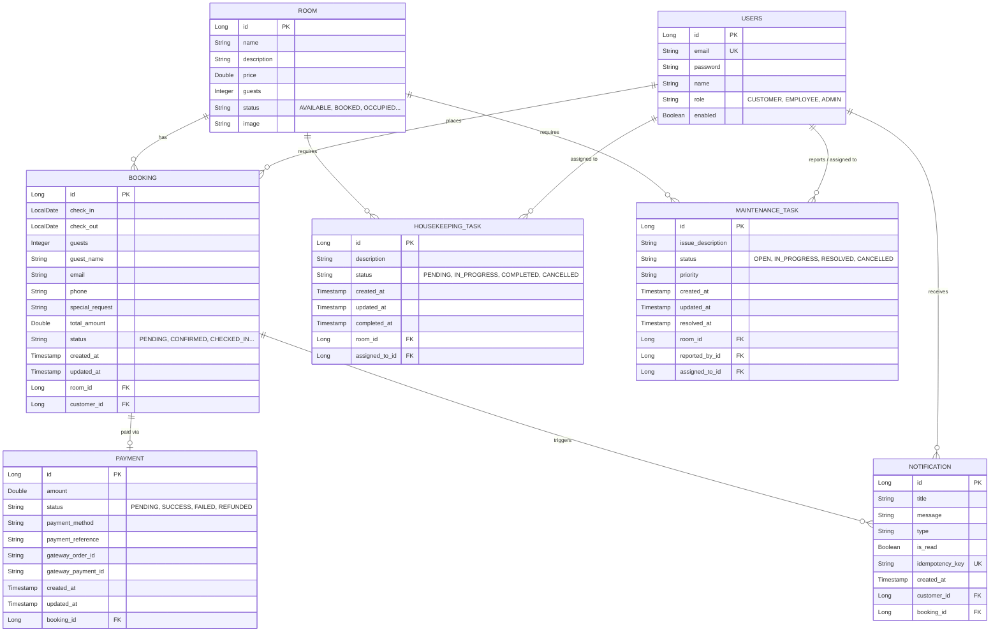

# Database Architecture

This document describes the persistence layer of the Resort Management System.

## Database Technology
- **Engine:** PostgreSQL (version 15, via Alpine Docker image)
- **Database Name:** `resort_management`

## Persistence
The application uses **Spring Data JPA** with **Hibernate** as the JPA provider to map Java objects to database tables.

## Schema Generation
The project currently relies on Hibernate's automatic schema generation:
`spring.jpa.hibernate.ddl-auto=update`

This instructs Hibernate to inspect the Entity classes on startup and automatically create or update tables to match. While suitable for initial development and demonstrations, production environments should transition to a migration tool like Flyway or Liquibase.

## Entity Model & ER Diagram

## Relationship Explanation

- **User → Booking (`@ManyToOne`):** A single User (Customer) can place multiple Bookings, but a Booking strictly belongs to one Customer.
- **Room → Booking (`@ManyToOne`):** A specific Room can have many historical or future Bookings, but a single Booking reserves exactly one Room.
- **Booking → Payment (`@OneToOne`):** A Booking maps to exactly one Payment lifecycle record.
- **Room → HousekeepingTask / MaintenanceTask (`@ManyToOne`):** A Room can accumulate multiple operational task records over time.
- **User → MaintenanceTask / HousekeepingTask (`@ManyToOne`):** Employees (Users) can be assigned to multiple tasks. Maintenance tasks also track the User who reported the issue.
- **User → Notification (`@ManyToOne`):** A Customer receives multiple Notifications over time.
- **Booking → Notification (`@ManyToOne`):** A specific Booking (e.g., confirmation event) can trigger specific Notifications.

